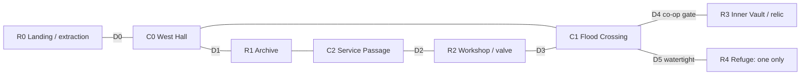

# Relic Tide — First-level real-time specification

Status: Stages 1–3 implemented on 2026-10-06. Stage 3 (physical doors, regional water flow, valve and one sealed refuge) is in the web build with passing rule, privacy, authority, scene, renderer and separate-process network checks; see REALTIME_VERIFICATION.md. Human playtesting and balance acceptance remain pending. Relics, co-op vault unlocking, breath, extraction and outcomes remain stage 4. User refinement: no whole-map view; follow the explorer; torches/held lantern widen sight; walls and shut doors block it. Numeric tuning is provisional, not measured balance.

## Fixed requirements

- Real-time online play for 2–4 people, physical interactions and extraction; no simultaneous-plan waiting or fixed traitor role.
- Rooms connect through corridors whose water rises.
- Normal closed doors delay room flooding.
- Only 1–2 refuge rooms per level; this level has exactly one.
- A refuge closed while dry stays completely protected from new water until reopened. No pressure failure, leak, timed protection expiry or forced flooding at match end.
- Only extracted treasure scores.
- Server authority and recipient-specific privacy; visible raster artwork and invisible collision.

## Level: The Sluice Vault

The level has five rooms and three corridor regions. scripts/level_map.gd owns stable ids, authored floor/obstacle coordinates and spawns matched to assets/ruin-movement.png. Logical coordinates are 1440×900; source art is 1586×992 and authored rectangles scale through from_art(). The current stage-3 build uses this topology for movement, sight, doorways and regional water.

| Id | Place | Purpose |
| --- | --- | --- |
| R0 | Landing | Spawn and extraction; ordinary flood protection, not a second refuge |
| R1 | Archive | Ordinary room and entry to the longer alternate route |
| R2 | Workshop | Ordinary room containing the flood-routing valve |
| R3 | Inner Vault | One valuable relic behind a two-person unlocking mechanism |
| R4 | Refuge | The only watertight shelter, one entrance and no other water source |
| C0 | West Hall | Approach from Landing and connection to Archive/main route |
| C1 | Flood Crossing | Main route and approaches to Workshop, Vault and Refuge |
| C2 | Service Passage | Alternate route between Archive and Workshop |

Topology (schematic, not game scenery):

| Edge | Connection | Object / water behavior |
| --- | --- | --- |
| E0 | R0 ↔ C0 | D0 ordinary extraction-room door |
| E1 | C0 ↔ R1 | D1 ordinary Archive door |
| E2 | C0 ↔ C1 | Open main passage |
| E3 | R1 ↔ C2 | Open service passage |
| E4 | C2 ↔ R2 | D2 ordinary Workshop west door |
| E5 | R2 ↔ C1 | D3 ordinary Workshop east door |
| E6 | C1 ↔ R3 | D4 ordinary vault gate with co-op unlocking latch |
| E7 | C1 ↔ R4 | D5 watertight refuge door |

Main approach: R0 → C0 → C1 → R3.
Alternate approach: R0 → C0 → R1 → C2 → R2 → C1 → R3.
Shelter is the side branch C1 → R4. It is not an extraction point. The main and alternate approaches share the final vault approach so players still meet; the alternate path offers a timing/valve choice, not permanent immunity.

Doors start open except D4 (closed and locked). D5 starts open and the refuge starts dry. All four players fit in the refuge; scarcity comes from the number/location of shelters, not an invented occupancy limit. Door controls are reachable from both sides. No room outside R4 is tagged watertight.

## Input and authoritative update

Initial controls: WASD/arrows to walk; E to use/hold the nearest valid object; Q to drop the relic; H guide; V reduced motion; R leave. Input focus disables gameplay actions while entering lobby text. Diagonal movement is normalized.

Initial server step: 20 Hz (50 ms). Initial snapshots: 10 Hz, plus immediate discrete event feedback as appropriate. Clients aim for smooth rendering, predict local movement and reconcile to authority. These rates are tuning values and require WAN/latency testing.

Each server tick:
1. Read valid ordered input/events; derive identity from the connection.
2. Update accepted interactions and door transitions against tick-start water and occupancy.
3. Apply water sources, drains and transfers for this tick.
4. Apply authoritative movement/crossing checks against current collision and water state.
5. Update breath, relic/extraction progress and terminal states.
6. Send recipient-filtered snapshots/events.

Events at the same tick use server sequence order. Clients cannot backdate a door command. Simultaneous relic pickups are resolved by the first valid server-sequenced event; later requests see that it is already owned. Record the ordering for reproducible rules tests without assuming cross-platform Godot physics is bit-identical.

## Doors, threshold and guaranteed shelter

Door states: open, opening, closing, closed; D4 also has a locked latch. Water permeability and passage collision follow actual opening progress. The refuge blocks water completely only once fully closed.

Initial open time is 0.6 seconds and close time 0.75 seconds. A doorway occupied by an explorer prevents final closure; show an obstructed state, retain nonzero opening/permeability, and never crush or teleport the explorer. A closing/obstructed doorway must not display a guaranteed-safe badge.

Initial normal-door closed permeability is 8% of its open permeability. This produces delay, not permanent protection. Closed refuge permeability is exactly zero; there is no pressure multiplier overriding zero.

The important deadline is **full closure before the first positive water transfer into R4**. The door threshold/waterline is the visual warning. If closure completes in a tick whose starting refuge is dry, the tick's water step sees a fully closed D5 and admits zero water, even if the exterior crosses the warning threshold in that step. If positive volume was admitted in an earlier step, the room is already wet. This ordering explicitly settles the same-tick boundary case.

| Situation | Rule |
| --- | --- |
| Close D5 completely while R4 is dry | R4 receives zero water and remains dry for every later closed tick |
| Keep D5 closed while exterior rises to maximum | Guarantee remains; no leak or breakage |
| Open D5 with higher exterior water | Water can enter according to the connection flow |
| Close D5 after R4 already has water | New inflow stops; existing water stays, without automatic drainage |
| Doorway obstructed before completion | Door is not sealed; warning remains active |
| Expedition timer expires | Preserve room water/safety; finish results without drowning occupants artificially |

Refuge protection is a property of the doorway and water model, not a temporary player buff. Dry protected space has no drowning/breath drain and does not depend on player count, relic ownership or remaining match time.

## Regional flood model and valve

Each region has a floor elevation, area and local water volume/depth. Connecting edges have threshold elevation and conductance; gates modify conductance and traversal. Sources/drains are explicit. Do not assign every room a global tide depth.

Compute water transfers from one shared previous state, cap outgoing water by available volume and apply transfers together. Water cannot flow through a zero-conductance refuge door. No negative volumes or hidden source exists inside the refuge. Tests may supply fixed time and seeded input.

Initial tide pacing: a 45-second exploration lead-in followed by gradually increasing source water through the rest of a 360-second expedition. Water-depth units describe gameplay thresholds; this is not a full fluid-physics simulation. Sources may fill corridors beyond movement thresholds but must not bypass room doors.

The valve in R2 has two positions:
- Main feed: incoming water goes to C1.
- Service feed: incoming water goes to C2.

Changing position takes a 1.5-second held interaction and redirects new incoming flow. C1 has an explicit passive outlet; after redirecting inflow, it can recede according to its outlet and connected-region water. Existing water never vanishes merely because a valve toggled. The competing inflow/drain rates need simulation and playtesting before asserting route timings.

This valve can help recover the main approach while endangering someone using the alternate route. It never drains a sealed refuge through a hidden connection.

## Movement and water effects

Initial base speed: 170 world pixels/second. Carry multiplier: 0.75. Nearby-use radius: 64 world pixels, measured from the authoritative position with obstruction checks. Distances will be adjusted to authored sprite/collision scale.

| Local depth | Movement / danger |
| --- | --- |
| Below 0.15 | Dry; normal walking |
| 0.15–0.6 | Shallow; speed × 0.8 |
| 0.6–1.2 | Wading; speed × 0.55 |
| 1.2–1.8 | Deep; speed × 0.35 and breath drains |
| 1.8 or more | Crossing into this area is blocked; an occupant remains subject to deep-water breath loss |

Initial breath maximum: 12 seconds. Deep water drains at one second per second; dry space restores at two seconds per second. Breath reaching zero yields drowned status and drops the carried relic locally. A dry sealed refuge must never lose breath due to outside tide. Show warnings before dangerous thresholds; do not teleport players away from rising water.

These numbers are prototype tuning, not a promise that the loop is balanced. Flood masks/visual waterlines must align with the region used for speed and crossing decisions.

## Cooperation, relic and extraction

D4 initially requires two distinct people holding its two outside controls in C1 simultaneously for 1.5 seconds. A single peer cannot occupy both controls. Releasing early resets unlocking progress. Completion unlocks the latch and opens D4; it then remains physically operable from either side by one person. No auto-close trap or one-way permanent lock is introduced.

This makes the initial vault entry genuinely cooperative while allowing later physical door blocking and a possible response by someone inside. Players may close the gate, compete for the relic, redirect water or leave a slow carrier.

Relic states: on pedestal, on ground(region/position), carried(player), extracted(player), unrecoverable. Exactly one state/owner exists. E picks up within reach; Q drops at the holder's local position. No direct remote inventory theft command exists. Visible carriers show the held relic; exact rival inventories and private scores remain filtered.

Initial relic value: 100 points. Extraction at R0 requires a 2-second held interaction in the extraction area and banks the carried relic atomically. Leaving/cancelling before completion banks nothing. Completion marks that explorer escaped; they cannot return in this slice. Empty-handed extraction is allowed.

A drowned carrier drops the relic where they drowned. It remains recoverable if the area can be reached. The expedition has no separate rescue bonus or private inventory-steal mechanic in this first slice.

## Session end and outcomes

Finish when all explorers are terminal (escaped/drowned) or the 360-second expedition limit is reached. Remaining dry refuge occupants are alive but unextracted/stranded; their carried relic does not score. Other survivors may also be unextracted. Do not label a living sheltered explorer drowned to simplify the old results model.

Only banked extraction counts. Highest extracted score wins; equal positive scores share the result. If no relic was extracted, report no successful relic extraction rather than manufacturing a winner from sheltering.

Retain current lifecycle: an active disconnect aborts the expedition; host leaving a lobby closes it; completed results remain after peers leave. Do not add reconnect or host migration during this slice. Guide/inactive tab behavior never pauses the server clock; lost focus sends neutral movement, with stale input expiring on the server.

## Observation and privacy

The user replaced whole-map viewing and strict same-region-only visibility on 2026-10-06 with light-dependent local vision. A player's own explorer is always visible. Rivals are included only within the observer's light radius and exact floor/obstacle/closed-door line of sight. Open connectors can expose a nearby rival across region ids. Out-of-sight packets contain only name/hidden state, with no position, region, velocity or held-light state. Clear cached render positions on disappearance. There is no global map/player minimap.

Prototype light values: unlit vision 105 logical pixels; held lantern 220; at a torch 250, tapering to 105 over 110 pixels of distance, provided the torch has LOS. One physical lantern begins on the Landing at source-art (205,741). E picks it up within 38 logical pixels and LOS; Q drops it at the holder's feet. Ownership is singular, peer-derived and ordered with its own event sequence and match token. Only visible ground-lantern coordinates and visible carriers' has_light flag are projected. No full map is revealed in lobby or play. The player-centered camera has 1.65× zoom without decorative drift. These values are playtest tuning.

Both vault controls remain in C1. Companions may see an approaching explorer through an open refuge doorway if lit/in range. A closed door must occlude their coordinates. Door animation and anonymous boundary cues remain readable without revealing unseen people. Never send full state to support an animation.

Publish local water, accessible boundary-object state, witnessed interactions and visible carried-object art. A global environmental tide indicator may be anonymous. Exact rival inventory/score and remote outcomes remain private until final results.

## Implementation ownership

- game.gd: pure domain rules for time-stepped flood, doors, relics, breath, extraction and outcomes; no scene/timer/input/rendering dependency.
- main.gd/scenes: player intentions, presentation, authored collision and world-object animation.
- room_directory.gd: room discovery/membership plus each room's authoritative expedition lifecycle.
- session.gd/server: ordered input/event transport, fixed-time execution, authority and snapshots.
- player_view.gd: recipient projection.
- Shared level definition: stable ids, regions, connections, floors/areas, colliders, thresholds, interact locations and raster masks. Create this when building the walkable scene, before duplicating coordinates in server/client code.

## Acceptance cases for implementation

| Id | Required proof |
| --- | --- |
| RT01 | Independent online movement for 2, 3 and 4 people; no wait-for-all turn |
| RT02 | Authoritative collision, bounded speed and correct diagonal motion |
| RT03 | Normal closed door demonstrably delays flooding compared with open door |
| RT04 | Early-sealed R4 stays at zero admitted water under maximum outside water for arbitrarily continued closed updates |
| RT05 | Same-tick closure/water threshold follows the specified server order |
| RT06 | Obstructed doorway is not sealed and does not crush/teleport a player |
| RT07 | Open-then-close after inundation retains admitted water; no magic drying |
| RT08 | Valve redirects new input; existing water recedes only through explicit flows/drains |
| RT09 | Simultaneous pickup produces one holder; duplicate/stale/out-of-range commands cannot duplicate relics |
| RT10 | Two-person latch requires distinct players; inside and outside gate use remain possible after unlocking |
| RT11 | Only completed extraction creates points; sheltered survivors remain alive/unextracted at deadline |
| RT12 | Serialized snapshots contain no remote rival coordinates, exact inventory or private score |
| RT13 | Visible relic/door/water visuals agree with authority; reduced motion retains gameplay feedback |
| RT14 | Disconnect, lobby close, result retention and return-to-lobby lifecycle remain explicit |
| RT15 | Level has exactly one refuge; future authored levels validate a 1–2 refuge limit |

Use the repository's SceneTree/check()/nonzero-exit pattern. Time-stepped rules cases use supplied simulation time. Actual movement/rendering needs real scene/network/renderer checks, not assertions that merely mirror frame indices. Port legacy assertions when their behavior is intentionally superseded.

## Stage-2 implementation evidence

Independent online movement, local light-dependent vision, wall/door occlusion, physical lantern ownership, doors and regional flooding are implemented. [REALTIME_VERIFICATION.md](REALTIME_VERIFICATION.md) records current automated checks, historical browser observations and asset provenance. The RT01–RT15 table also contains later-stage relic and extraction requirements; it is not a claim that the complete game loop has shipped.

## Legacy baseline captured before code migration

Godot: 4.7.2.stable.official.ed1daf0bf, local executable discovered through the launcher configuration. Results collected on 2026-10-06:

| Suite | Result |
| --- | --- |
| rules_test.gd | 41,390 checks, 0 failures |
| privacy_test.gd | 39 checks, 0 failures |
| authority_test.gd | 30 checks, 0 failures |
| scene_test.gd | 106 checks, 0 failures |
| render_test.gd with actual NVIDIA/OpenGL renderer | 4 checks, 0 failures |
| Run-NetworkTests.ps1 | All 6 scenarios passed: 2/3/4-player matches, participant disconnect, host leave, lobby discovery |
| web_smoke_test.mjs against temporary loopback web/room service | 8 checks, 0 failures: HTTP export, MIME/payloads, source exclusion and WS upgrade |

These are tests of the legacy runtime. They establish a clean migration starting point, not proof of RT01–RT15 or manual browser playtesting. The temporary test service was stopped after the web check. Godot emitted a root-certificate-store warning; the local rules/renderer/plain-WebSocket tests passed. No claim about HTTPS/WSS or WAN performance follows from these results.
